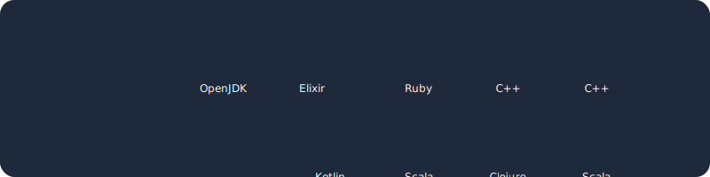

  

### 👋 Hey, I'm Shaad Ahmad

**GenAI Developer · Full-Stack Builder · AI Enthusiast**

I build mobile apps, web tools, and AI-powered projects.
Currently working on **Cardoo** — a digital identity app for India 🇮🇳

---

### 🚀 Featured Projects

| Project | Description | Tech |
|---|---|---|
| [**Cardoo**](https://github.com/shaadahmade/whitecardfinal) | Digital identity app — store & share Aadhaar, PAN, DL via QR | Kotlin · Jetpack Compose · Firebase |

---

### 🛠️ Tech Stack

---

### 📊 GitHub Stats

---

### 📫 Get in Touch

